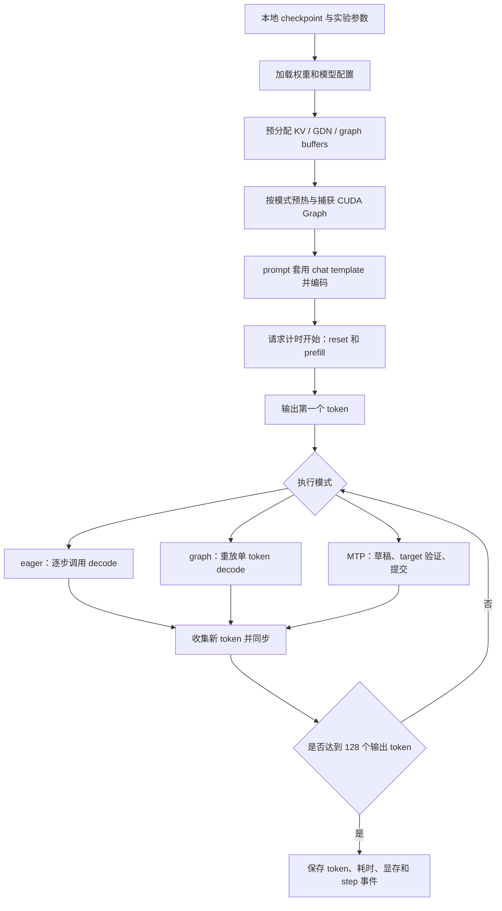

# Swift Decode 项目详解与面试准备

整理日期：2026-10-04。以当前 `study` 分支代码和 2026-10-03 的云端反馈为依据。
本文用于理解、复述和追问准备；实际运行步骤见 [单卡实验说明](../experiments/README.md)
和 [一致性 benchmark 步骤](../experiments/CONSISTENT_BENCH.md)。阅读本文不需要启动 GPU。

**先记住项目主线：在单张 RTX 5090 上跑通 27B INT4 模型，建立 eager、CUDA Graph、
MTP 的可重复对照；定位 MTP 输出分叉，修正一致性模式，最后在输出逐 token 相同的
条件下测得 MTP 相对 CUDA Graph 约 2.00–2.26 倍的解码速度。**

已有 [面试笔记](../reports/rtx5090-2026-10-03/INTERVIEW_NOTES.md) 适合快速复习；
本文展开执行流程、状态管理、数值问题、实验口径，以及 40 个面试问题。

## 阅读顺序

| 你的目标 | 建议阅读 |
|---|---|
| 先知道做了什么 | 第 1、2、8 节 |
| 能讲清楚为什么加速 | 第 3–6 节 |
| 讲出自己的工程工作 | 第 7、9 节 |
| 对照代码理解实现 | 第 10 节 |
| 准备面试 | 第 11、12 节，再用第 13 节自测 |

<a id="overview"></a>

## 1. 项目解决什么问题

### 1.1 场景与目标

场景是**单卡、单请求、单流的文本生成**。给定一个 prompt，模型逐步生成回答，
关注首 token 之后的生成速度、首 token 时间、显存和输出一致性。

普通自回归生成有一个串行依赖：下一个输入 token 必须等当前 token 生成。
即使 GPU 算力很强，一个请求每步只处理很少的数据，也可能无法充分利用计算资源。
与此同时，大模型权重很大，反复读取权重和启动许多小算子都会消耗时间。

Swift Decode 围绕三个问题组织实验：

1. **能否在 32 GB 显存中运行这个模型？** 使用已有的 INT4 checkpoint，保留必要的
   BF16/FP32 数据和显式推理状态。
2. **能否减少每个 decode step 的开销？** 对照 eager 和 CUDA Graph 的执行方式。
3. **能否一次 target 验证产生多个有效 token？** 使用 MTP 草稿与验证，并检查生成
   结果是否与逐 token 路径相同。

这里的 target 是负责最终判定输出的主模型，draft 是提出候选 token 的草稿路径。

### 1.2 系统能力和本次完成的工作

底层引擎来自 [Token Rush](https://github.com/zyhector/token-rush)，起点为 `b592bc6`。
理解完整系统时可以讲量化、融合算子、CUDA Graph、MTP；回答个人贡献时，应对应实际
新增代码和实验。两者放在下面这张表中，便于准备面试。

| 层次 | 内容 | 本项目中的角色 |
|---|---|---|
| 模型与引擎 | INT4 权重格式、模型 forward、Triton 算子、CUDA Graph、MTP | 采用并阅读上游实现，完成环境适配与实测 |
| 实验框架 | 三种模式统一入口、预热、计时、输出比较、独立 worker | 本仓库新增 |
| 可追溯记录 | 配置与源码指纹、环境、源码快照、逐请求 token、step 事件 | 本仓库新增 |
| 分叉诊断 | 重放、固定 hidden 的 head 对照、相同状态的算子追踪 | 本仓库新增 |
| 局部修正 | `consistent=True` 下固定 GDN 的完整 value head 路径 | 根据控制实验新增 |
| 性能核验 | benchmark 与 gate 匹配，并再次比较实际输出 | 本仓库新增、云端验证 |

第一版复现实验已完成。当前资料能支持单流推理和数值诊断的讨论；独立 BF16 精度评估、
长上下文、并发服务和其他推理框架的公平对比，仍属于后续问题。

### 1.3 关键术语

| 术语 | 在本项目中的含义 |
|---|---|
| token | tokenizer 产生的整数 ID；一个汉字、词或代码片段不一定对应一个 token |
| hidden | 模型内部表示；本次诊断中的最后一层 hidden 宽度为 5120 |
| logits | 每个候选 token 的未归一化分数；greedy 直接取 argmax |
| prefill | 处理已知 prompt，建立状态并产生第一个输出 token |
| decode | 在已建立的状态上继续生成后续 token |
| KV cache | full attention 保存的历史 key/value，避免反复计算历史投影 |
| GDN | Gated DeltaNet，用递归矩阵状态保留历史信息的模块 |
| CUDA Graph | 捕获 GPU 操作序列，后续重放以减少重复调度开销 |
| MTP | Multi-Token Prediction；本项目使用随 checkpoint 提供的 MTP head 生成草稿 |
| gate | 进入性能对照前的正确性检查关卡 |
| consistent | 本项目显式选择的数值执行策略，不是“任意输入都已证明一致”的保证 |

## 2. 一次请求如何经过系统

### 2.1 先区分初始化与请求执行

**进程初始化**包括加载权重、构建状态、Triton 编译与调优、CUDA Graph 预热和捕获。
**请求执行**从已编码好的 prompt 开始，重置状态、prefill、生成首 token，再循环 decode。
当前计时衡量后者，未衡量模型加载和图捕获的冷启动成本。



实验入口是 [single_gpu.py](../experiments/single_gpu.py)，GPU 适配层是
[gpu.py](../experiments/gpu.py)。入口负责实验协议，Adapter 将统一的
`prime()` / `step()` 接口接到引擎上。

### 2.2 Prefill 和 decode 为什么不同

prefill 的 prompt 已经全部给定，因此投影可处理多行输入，attention 通过因果约束
限制可见位置；GDN 使用对应的序列处理路径。decode 时未来 token 未知，普通路径
每次只新增一个输入位置。

前者通常有更大的矩阵计算，后者更容易受权重读取和调度开销影响。这是解释优化方向的
机制分析；本次没有 profiler 数据，不能直接给出“带宽占比多少”或“launch 占比多少”。

首 token 来自 prompt 最后一个位置的 logits。之后第一次 decode 把这个**已经输出、
尚未写入 target 状态**的 token 作为输入，生成它的后继。
理解这点，才能避免 MTP 的 token 计数和位置更新出现一位偏移。

MTP 的 prefill 还会使用 target 的逐位置 hidden 初始化草稿头。
实现见 [prime_spec](../tokenrush/spec.py)：相邻位置的 token 和上一位置的 hidden
配对，处理跨 chunk 的最后一行，然后设置第一个 committed token。

### 2.3 三种模式的实际差别

| 模式 | Adapter 调用 | 每个 step 返回的新 token | 主要作用 |
|---|---|---:|---|
| eager | `engine.decode()`，再 greedy 选词 | 1 | 逐步执行的调度基线 |
| graph | `engine.step()` | 1 | 重放单 token 计算图 |
| mtp | `engine.spec_step(3)` | 1–4 | 草稿、批量验证与提交在同一张图中执行 |

三条路径均复用这个引擎的模型和算子。eager 本身已经使用量化和融合实现，不能把它
描述成原生 Hugging Face 或完全未经优化的 PyTorch 基线。MTP 模式也使用 CUDA Graph，
因此 `MTP / graph` 衡量的是在图执行基础上引入投机解码后的整体收益。

## 3. 27B 模型为什么能放进单卡

### 3.1 INT4 的存储账

先只估算权重：27B 个 BF16 参数约为 `27e9 × 2 = 54 GB`，已经超过 32 GB 卡容量。
本项目加载的是预先量化好的 checkpoint，大矩阵使用每组 128 个权重的非对称 INT4：

```text
每个权重：4 bit 的整数 q，范围 0..15
每组参数：BF16 scale + BF16 minimum，共 32 bit
近似还原：w_hat = scale × q + minimum
平均位宽：4 + 32 / 128 = 4.25 bit / weight
```

如果理想化地把 27B 个参数都按此格式存储，约为 `27e9 × 4.25 / 8 = 14.34 GB`。
实际还有保留 BF16 的张量、草稿模块、缓存和运行时分配，不能把这个估算当成整卡占用。
下载目录约 17.07 GB，本次 MTP 的 PyTorch 峰值 allocated 约 17.11 GiB，两者统计对象
和 GB/GiB 单位都不同。

在 [quant.py](../tokenrush/quant.py) 中，一个字节打包两个 INT4 code，低 4 bit 存前一个，
高 4 bit 存后一个。scale 和 minimum 按输入维度分组，并与 packed weight 一起保存。
格式说明还可参见仓库原有 [model card](model_card.md)。其中原作者的质量指标不属于
本次复现实验。

### 3.2 Weight-only 的意思

INT4 主要压缩**权重存储和读取**，不代表所有计算、激活、KV 都变成 INT4。
当前配置中，KV 使用 BF16，GDN recurrent state 使用 FP32，多个算子使用 BF16 输入和
FP32 累加。小矩阵、embedding、norm 等也有各自的数据类型选择。

短序列 Triton 投影在 kernel 内按块读取 packed weight，解包和反量化后参与计算，
避免为每次短 decode 在显存中展开整个 BF16 权重矩阵。长 prefill 在当前 `QLinear`
分派中可能走完整反量化加 `F.linear`，因此不能把短 decode 的内核行为推广到所有长度。

本次 target 直接加载上游 GPTQ checkpoint，没有重新执行 GPTQ 校准。
另一个细节是：checkpoint 中 MTP 权重按 BF16 保存，Adapter 调用
`build_mtp(..., int4=True)` 时会将其若干线性层用 `quantize_int4` 转换为 INT4。
这个加载时转换使用 round-to-nearest，不等于重新训练或完成了一套新的 GPTQ 方法。

### 3.3 为什么量化可能加快 decode

一个小 batch 的线性层，读入很大的权重矩阵，却只服务很少的输入行。
减少权重字节数，有机会降低每步读取成本；代价是反量化操作和量化误差。

常用的粗略下界是：

```text
一步耗时 >= max(需要读取的字节 / 有效带宽, 运算量 / 有效算力)
```

这只是分析工具。真实时间还包括调度、同步、缓存行为和未重叠的工作；没有实测的
有效带宽与算子统计，不能把硬件宣传值直接换算成项目已达到的性能。

## 4. 模型结构与三类状态

### 4.1 这是混合架构

引擎根据 checkpoint 的 `layer_types`，交替执行 full attention 或 GDN，然后执行 MLP，
中间有 residual 和 RMSNorm。层数、head 数和维度由
[ModelConfig.load](../tokenrush/config.py) 读取，不依赖讲解中手写的默认值。

```text
token embedding
  → [residual/norm → full attention 或 GDN → residual/norm → MLP] × 层数
  → final norm
  → lm_head
  → greedy argmax
```

GDN 将遗忘门和 delta 更新结合，用递归状态维护历史信息。
相关概念来自 [Gated Delta Networks 论文](https://arxiv.org/abs/2412.06464)；
本项目实际运算顺序应以 [gdn_forward](../tokenrush/model.py) 和
[_gdn_step_fused_kernel](../tokenrush/fused.py) 为准。

### 4.2 Full attention 的 KV cache

K/V 分配形状为：

```text
[full_attention 层数, KV head 数, max_len, head_dim]
```

每个新增位置将自己的 K/V 写入 cache，然后读取因果范围内的历史。
KV 减少了对旧 token 的 K/V 重算，但读取历史 K/V 的成本仍随有效上下文增长。

设 full attention 层数为 `L_attn`，KV head 数为 `H_kv`，head 宽度为 `D`，
每元素字节数为 `b`，则新增一个位置需要的 KV 容量为：

```text
KV_bytes_per_token = 2 × L_attn × H_kv × D × b
```

本轮 `b=2`。代码预分配至 `max_len=4096`，因此**分配容量**与当前已使用位置数不同。
实现见 [State](../tokenrush/state.py) 的 `k`、`v` 和 `kv_bytes_per_token`。

### 4.3 GDN 的 recurrent state

为便于理解，令某个 head 的状态矩阵为 `S`，形状为 `[key_dim, value_dim]`。
省略卷积、归一化和输出门以后，kernel 中的核心更新可写为：

```text
S_decay = alpha × S_prev
delta   = beta × (v - kᵀ × S_decay)
S_new   = S_decay + k × delta
o       = qᵀ × S_new
```

这里 `k × delta` 是外积。`alpha` 控制旧信息衰减，`beta` 控制本次修正的强度。
直观上，模型先查看旧状态对当前 key 的预测，再按预测残差更新状态。

这个矩阵的尺寸不随序列长度增长。代价在于它压缩了历史，不能把所有旧 token 当作
full attention 的完整 KV 历史来任意访问。整个模型仍包含 full attention 层，因此
不能由“GDN 状态固定”推出“模型所有缓存和 decode 成本都与上下文无关”。

真实状态张量是：

```text
rec: [n_slots, GDN 层数, value head 数, key_dim, value_dim]，FP32
```

MTP 需要保留不同候选前缀之后的状态，所以增加 slot 维度。固定深度 3 时需要 4 个 slot，
后面将解释为什么接受 n 个草稿后选择 slot n。

### 4.4 Conv ring、位置和状态重置

GDN 还使用短卷积，保存最近若干位置的卷积输入。仓库采用长度为 16 的环形缓冲区，
列位置是 `pos % 16`，用来容纳有效历史和投机写入的候选尾部。

`State` 同时维护 CPU 上的 `pos` / `slot_h`，以及设备上的 `pos_t` / `slot`。
图内计算读取设备张量；图外代码维护 host mirror。两者数值对齐是必要检查，
但“计数相同”不能证明张量中的 KV 或 recurrent state 数值也相同。

`reset()` 会清空 recurrent state、conv ring 和位置。它没有每次清空整个 K/V 张量，
因为有效位置和因果访问范围控制了可以读取的前缀；新请求会覆盖自己的有效位置。
这种做法要求所有读取严格遵守有效范围。

## 5. CUDA Graph 如何减少每步开销

### 5.1 捕获与重放

普通 eager 执行每步都会经过 Python、框架和驱动的调度链，依次提交 GPU 操作。
CUDA Graph 将可捕获的操作序列记录下来，后续通过 replay 提交同一张图，减少重复的
host 调度工作。固定的地址、形状和执行结构是其约束，新请求可以改变输入缓冲区中的值。
这些原则见 [PyTorch CUDA Graph 官方说明](https://docs.pytorch.org/docs/2.14/notes/cuda.html#cuda-graphs)。

在本仓库中，`Engine.capture()` 预热并捕获 `_graph_step()`；`Engine.step()` 重放图。
图内完成模型 forward、选取下一个 token、更新设备位置，并把新 token 写回 `self.tok`。
于是下一次 replay 可以直接消费它。

### 5.2 为什么不能只保存 Python 变量

假设 Python 整数 `pos=100` 参与捕获，之后仅把 Python 变量改成 101，并不意味着已捕获
的 kernel 参数也发生变化。本项目将动态位置放入固定地址的 `pos_t`，kernel 执行时
读取它的值。同理，`tok`、`slot`、`n_accepted` 都是设备张量。

下面是理解流程的伪代码，不是直接运行的 API 示例：

```text
初始化：分配长期存活的 tok、pos_t、KV、rec 和输出缓冲区
预热：编译与调优，准备执行所需资源
捕获：记录 forward → argmax → 写回 tok → 更新 pos_t
请求：prefill，把首 token 写入 tok
循环：graph.replay() → 取回新输出 → 再 replay
```

### 5.3 图捕获与融合 kernel 是两件事

融合 kernel 将多个算子合并，减少 kernel 数量和中间张量读写。
CUDA Graph 减少这些 kernel 被反复提交时的调度成本。图中仍可能存在许多 kernel，
一次 replay 不代表整模型变成一个 kernel。

本项目同时使用两类手段，例如 residual+RMSNorm 融合、GDN 融合，以及整个 decode step
的 CUDA Graph。仅根据 graph/eager 的速度差，无法精确拆出每类开销。

### 5.4 图内仍有动态值，图外仍有同步

MTP 的接受数每步可能变化，但验证行数固定为 4。通过设备上的比较、`cumprod`、
`gather` 和位置更新，可以保持图的形状和操作序列固定。

当前实验每步仍要取回 token，MTP 还读取接受数，并执行计时所需同步。
因此不能把它描述成完全没有 CPU 参与或整段生成只有一次 GPU 提交。

## 6. MTP 投机解码：草稿、验证与提交

### 6.1 MTP head 从哪里得到信息

MTP head 使用“下一个已知 token 的 embedding”和“前一个位置的 target hidden”，
分别归一化后拼接，经线性层映射回模型 hidden 宽度，再通过一个 attention/MLP block
和输出 norm，预测后续 token。embedding 和完整 lm_head 来自主模型。
具体结构见 [mtp.py](../tokenrush/mtp.py)。

固定深度 3 表示用这个草稿头连续提出 3 个候选，不表示新增了 3 个独立完整模型，
也不表示三个候选天然可以在一次普通 MTP forward 中全部并行产生。
实际 `_spec_step(3)` 先校正草稿侧的上下文，再链式产生后续草稿。
第一个草稿使用真实 target hidden；后续候选尚无对应的未来 target hidden，链式计算
使用前一步 MTP 的 hidden 继续预测，等 target 验证后再校正接受前缀的信息。

Target 验证只调用一次主模型，处理“已提交输入 + 3 个草稿”，得到 4 行 logits。
把草稿的计算成本控制在这次验证所节省的 target 调用成本之内，才可能加速。
草稿辅助、target 验证是投机解码的一般思路，可参考
[Fast Inference from Transformers via Speculative Decoding](https://proceedings.mlr.press/v202/leviathan23a.html)。
本实验验证的是 greedy 生成，不涉及随机采样分布的实测结论。

### 6.2 四行验证究竟在算什么

令 `c` 是上一步已经输出、当前尚未写入 target 状态的 token，草稿为 `d1,d2,d3`：

```text
target 输入行：    c       d1      d2      d3
target 预测：      p0      p1      p2      p3
需要比较：        p0=d1?  p1=d2?  p2=d3?
```

这是**同一条序列的 4 个连续位置**。attention 保持因果访问，GDN 在 block 内按顺序
更新状态；多行线性投影可以复用一次读入的权重。不能把它说成四个独立请求的 batch，
也不能说 GDN 的递归依赖被消除了。

接受规则只认最长匹配前缀。例如比较结果为 `[True, False, True]`，只接受第一个草稿。
第三行的预测建立在已经错误的草稿前缀上，不能跳过中间错误继续接受。

### 6.3 最需要会手算的表

设连续接受的草稿数为 `n`：

| n | 本 step 新输出 | target 新处理的有效输入 | 位置增量 | live recurrent slot |
|---:|---|---|---:|---:|
| 0 | `p0` | `c` | 1 | 0 |
| 1 | `d1, p1` | `c, d1` | 2 | 1 |
| 2 | `d1, d2, p2` | `c, d1, d2` | 3 | 2 |
| 3 | `d1, d2, d3, p3` | `c, d1, d2, d3` | 4 | 3 |

`p_n` 在首次不匹配时是纠正 token，全部匹配时是 bonus token。它已经可以对外输出，
但对应输入尚未提交进 target 状态，会作为下一步的 `c`。

因此，本轮输出是 **accepted drafts + target 的纠正/bonus token**。
输入 `c` 已经输出过，不应再次计数。实验 Adapter 正是按这个规则返回 `Step`。

对应代码逻辑可以简化为：

```python
# 讲解用伪代码；真实实现将接受数、索引和位置保留为设备张量。
inputs = [committed_token] + drafts
pred = target_verify(inputs).argmax(axis=-1)
n = length_of_matching_prefix(pred[:K], drafts)
new_outputs = drafts[:n] + [pred[n]]
position += n + 1
live_slot = n
committed_token = pred[n]
```

阅读 [_verify_step](../tokenrush/model.py) 后再看 [Adapter.step](../experiments/gpu.py)。
旧生成包装函数或个别注释可能以“下一轮再输出 committed token”的方式描述收集顺序，
本文以当前实验 Adapter 的实际返回值为准。

### 6.4 被拒绝的状态怎样处理

验证时会计算整个候选 block，所以必须分清“物理上写过”和“逻辑上已提交”。

| 状态 | 验证产生什么 | 接受前缀后的处理 |
|---|---|---|
| GDN recurrent state | 输入每一行之后的状态，写入 slot 0..3 | `slot=n` 选择有效前缀的快照 |
| Full attention KV | 候选位置对应的 K/V | 按提交位置限定有效范围，后续覆盖无效尾部 |
| Conv ring | 各候选位置的卷积输入 | 依靠环形容量和逻辑位置保留有效历史，重写后续位置 |
| MTP 自身状态 | 草稿路径使用的 hidden 和 KV | 下轮用真实接受前缀和 target hidden 校正，再生成新草稿 |

GDN 将每个前缀状态保存在独立 slot，避免在拒绝后通过数值逆运算“撤销”递归更新。
`n=1` 时提交的是处理过 `c,d1` 的状态，因此选择 slot 1；不是 slot 2。

固定形状的 MTP 校正阶段会处理 `K+1` 行，其中只有到上一轮接受位置为止的前缀有意义。
实现通过设备索引取出正确的那一行，再继续草稿链。padding 或无效尾部必须受位置和
因果访问控制，不能进入已提交前缀。

### 6.5 为什么可能比逐 token 快

普通路径获得多个后续 token，通常需要多次经过完整 target。
MTP 先用便宜的草稿头猜一段，再让 target 一次检查多个连续位置。
多行投影能在一个权重块被读取、反量化后服务多个输入行，从而摊薄权重读取成本。

设每步提出 `K` 个草稿，总接受率为：

```text
r = 所有 step 的 accepted drafts 总数 / proposed drafts 总数
```

固定 K 时，在最终输出截断之前：

```text
平均每步可用输出 = 1 + K × r
大致加速比       ≈ T_graph_step × (1 + K × r) / T_spec_step
T_spec_step      包含草稿生成、target 验证、状态处理及对应 host 开销
```

代码输入的 `r≈0.6087`，所以平均每步可用输出约 `1 + 3×0.6087 = 2.83`，
实测 MTP/graph 约 2.26。接受率和平均输出数解释了收益方向，但都不能直接当作速度倍数。

这里 r 是实际累计的接受数比例，没有假设每个位置独立同分布。
最后一步可能计算超过 128 token 所需的尾部，所以最终计入分子的平均输出数还要扣除
被截断的部分；完整 step 耗时仍然计入。

### 6.6 为什么草稿词表可以缩小

当前 Adapter 使用前 `min(131072, vocab_size)` 个 token 作为 draft vocabulary，
减少草稿侧 lm_head 读取。target 最终验证仍使用完整词表。

词表外的 token 不能被草稿提出，但 target 可以通过纠正或 bonus 输出它。
因此在 target 验证和状态逻辑正确的前提下，缩小草稿词表主要影响接受率和草稿成本，
不会直接把最终输出限制为这个子集。本次未做词表大小消融，不能断言这个上限最优。

### 6.7 哪些情况下 MTP 可能变慢

接受率低时，每轮花了额外草稿成本，最后可能只输出一个 target token。
加深草稿链也会增加草稿时间、验证行数、状态快照和无效尾部计算。
长上下文会改变 attention 成本，高并发会改变权重复用和 GPU 利用率，收益都可能变化。

本次只验证了固定 depth 3 的单流配置。没有完成 depth sweep，也没有采用上游可选的
动态深度策略；“depth 3 最优”不在已取得的结论中。

## 7. 最有价值的排障：MTP 为什么和 graph 输出不同

### 7.1 先观察现象，不直接归因

`gate-001` 中，eager 和 graph 输出相同，各模式三轮也分别稳定。
MTP 在英文、代码、中文的输出索引 20、61、69 发生首次分叉，索引从 0 开始。

这说明问题可重现，值得沿真实执行路径定位。候选原因包括输出收集错位、状态提交错误、
不同 shape 触发不同数值路径等。仅凭“差异很小”不能跳过 gate。

### 7.2 第一层：重放并检查收集与计数

[diagnose_mtp.py](../experiments/diagnose_mtp.py) 使用保存的输入和配置重放，确认与原结果一致。
它检查 emitted tokens 是否等于本轮 target argmax，已提交 token、位置和 slot 是否对齐。

英文分叉时，两个候选的分数如下：

| 候选 | token ID | graph logit | MTP target logit |
|---|---:|---:|---:|
| ` executed` | 15234 | 21.75 | 21.625 |
| ` granted` | 11340 | 21.625 | 21.625 |

graph 选择 ` executed`；MTP 两个候选打平，argmax 选择较小 ID 的 ` granted`。
两条路径的最大 logits 绝对差为 0.125。

由此可以说：这一次输出收集忠实反映了 target 的选词，选词变化确实对应 logits 变化。
还不能说：KV 和 recurrent state 内容已正确，或者某一个 kernel 已被定位为原因。

### 7.3 第二层：冻结 hidden，隔离 lm_head

诊断记录显示 `lm_head` 的 M=1 和 M=4 自动调优配置不同。配置差异构成调查线索，
不是因果结论。因此新增 [probe_mtp_head.py](../experiments/probe_mtp_head.py)：

1. 恢复保存的 15 条调优记录，重放到分叉位置。
2. 取实际 hidden，分别做单行、四行 head 投影。
3. 暂时把四行 head 设置成单行配置，再做一次对照。

结果是每份固定 hidden 的 logits 全部逐值相同，MTP hidden 重投影也重现了原 logits。
但 graph/raw 与 MTP 的 hidden，在 5120 个元素中已经有 4359 个不同，最大绝对差 0.125。

因此，对这次分叉，应把调查位置移到 head 之前。这个实验隔离了 head 的输入，
但没有证明 head 在所有输入、所有配置下都逐值等价。

### 7.4 第三层：恢复相同状态，追踪最早观测差异

[trace_verify.py](../experiments/trace_verify.py) 先确认 raw/MTP 的 prefill 结果相同：
包括 hidden、有效 KV 前缀、live recurrent state、conv ring 和首 token。
再从同一份已提交状态、同一组实际 token 开始，对照逐 token 和四行验证的各层输出。

第一个 block 位于 position 32，包含 4 行。最早观测到的差异在
`layer.0.gdn.output` 的第 2 行，6144 个值中有 1 个不同，最大绝对差约 `2.98e-8`。
此时 argmax 还相同，所以“还没出现 token 分叉”不表示中间数值已经相同。

接着做恢复同一初始状态的控制实验：

| 设置 | 1365 处观测中有差异的数量 | 最终 hidden/logits |
|---|---:|---|
| 原配置 | 1246 | 不同 |
| 只固定完整 GDN value head，`BV=128` | 0 | 逐值相同 |
| 只统一 target 多行量化投影的调优配置 | 1246 | 不同 |
| 同时使用两项设置 | 0 | 逐值相同 |

这组干预证据支持：**对被追踪的这个 block，统一 GDN 分块足以消除所有观测差异；
只统一量化投影配置没有达到这个效果。** 后续各层可能独立引入舍入差异，不能把 1246 处
差异全部描述成那个最早单值差异的逐层放大。

### 7.5 修正为何选择完整 value head

原 fused GDN 的默认策略是 `M<4` 时 `BV=V`，`M>=4` 时 `BV=V/2`。
BV 表示一个 program 处理多少 value 维度。

当 `BV=V` 时，一个 program 处理完整 head，也在同一个 kernel 中做 gated norm；
分成半个 head 时先写中间输出，再由另一 kernel 完成 norm。分块、编译布局和运算路径
不同，有限精度结果可能不同。

本次修改沿正常调用链传递 `BV`，在 `Engine(consistent=True)` 下设置
`gdn_bv=cfg.gdn_v_dim`，让单行和四行都走完整 head 路径。
它保留 kernel 原有数学公式、greedy 选择和逐 token gate 判定，没有修改为容差通过。

另一个原有一致性设置是 `ROWS_FOR_ONE=True`，让单 token 也使用多行量化 kernel。
它不意味着 M=1 和 M=4 的 autotune 参数全部相同；这次永久修正也没有全局锁定调优缓存。

随后 `gate-002` 的完整生成通过。进一步让 benchmark 同样使用一致性路径并匹配 slot
分配后，`gate-003` 和 `bench-002` 完成了正式的配对验证。
完整历史和限定保存在 [MTP 诊断记录](../experiments/MTP_DIAGNOSTICS.md)。

### 7.6 这段经历可以怎样概括

排障顺序是：**重现 → 对齐输入输出 → 检查状态计数 → 冻结中间输入隔离模块 →
同状态逐层追踪 → 单变量干预 → 局部修正 → 完整生成回归 → 匹配配置的性能复测。**

这一顺序的价值是每一步都有明确的待排除因素。不要跳过证据，把故事压缩成
“BF16 精度不够，所以改了一个参数就好了”；相同数据类型也会因执行路径不同而分叉。

## 8. 实验结果：数字应该怎样解释

### 8.1 本次配置

| 项目 | 配置 |
|---|---|
| GPU / 请求方式 | 单张 RTX 5090 32 GB；单请求、单流 |
| 模型 | `zyhector/Qwen3.8-27B-TokenRush-int4g128` |
| 模型 revision | `29a49013c25005b32d436efc5324a4fcfd03bacd` |
| 后端 / KV | Triton / BF16 |
| 生成方式 | greedy，temperature=0，关闭 thinking |
| MTP | 固定 depth 3，draft vocabulary 上限 131072 |
| 长度 | 固定输出 128 token，忽略 EOS；最大分配长度 4096，prefill chunk 512 |
| 输入 | 英文 OS 调度解释、Python LRU 实现、中文数据库索引解释 |
| 重复 | 每模式每输入预热 2 轮，测量 3 轮 |
| 数值策略 | 三种模式均为 `consistent=True, max_spec=3` |

环境为 torch `2.14.0+cu130`、Triton `3.8.0`、Transformers `5.17.0`，
FLA 固定到 `516143e31fce09925e6c39ac37148444bad176c4`。
模型离线加载。三条 prompt 原文见 [prompts.json](../experiments/prompts.json)。

### 8.2 主结果

以下均为每组 3 轮中位数，加速比取对应中位数之比。
来源是 [bench-002.summary.json](../reports/rtx5090-2026-10-03/bench-002.summary.json)。

| 输入 | eager token/s | graph token/s | MTP token/s | graph/eager | MTP/graph | 草稿接受率 |
|---|---:|---:|---:|---:|---:|---:|
| 英文 | 66.37 | 88.88 | 177.54 | 1.34× | 2.00× | 48.72% |
| 代码 | 59.72 | 88.88 | 200.56 | 1.49× | 2.26× | 60.87% |
| 中文 | 53.67 | 88.81 | 188.30 | 1.65× | 2.12× | 53.06% |

三种模式、三条输入、三轮重复，共 27 个测量请求。
本轮内部比较 27/27 通过，与保存的 gate 比较也为 27/27 通过。
这两组检查作用于同一批 27 个请求，不是 54 个独立样本。

主结论应表述为：**本次三条短输入、固定 128 token 的等输出对照中，MTP 相对
CUDA Graph 的后续解码速度为 2.00–2.26 倍。**

代码输入有较高接受率，也有较高加速比；这三条输入只能支持该组观察，不能据此
概括所有代码任务都比中文或英文更适合 MTP。

### 8.3 首 token、整段生成和显存

下表范围取三条输入各自中位数的最小值和最大值，并非单次运行的波动范围。

| 模式 | 首 token 时间 ms | 含首 token 的生成速度 token/s | 峰值 allocated GiB | 峰值 reserved GiB |
|---|---:|---:|---:|---:|
| eager | 369.2–387.3 | 46.48–56.14 | 16.549 | 16.955 |
| graph | 370.5–387.6 | 70.47–71.11 | 16.549 | 16.959 |
| MTP | 380.6–394.7 | 115.14–125.61 | 17.113–17.114 | 17.701 |

MTP 增加约 0.564 GiB 的峰值 allocated、约 0.742 GiB 的 reserved。
这些来自 PyTorch allocator，包含当前常驻权重、状态、缓存和图相关分配；不是整卡
显存，也不是纯 KV 用量。由于这组 eager/graph 同样保留 4 个 target slots，差额还不能
推广为所有配置下“开启 MTP 的固定成本”。

MTP 主要优化后续 decode；prefill 和草稿准备还会影响首 token，所以不能把 decode 的
约 2 倍收益直接套到首 token 延迟或整个请求上。

### 8.4 历史正常路径为什么保留但不作主结果

`bench-001` 使用 `consistent=False`，MTP 的输出再次在 20、61、69 处分叉。
当时记录的速度仍有诊断价值，但不能与后来输出相同的结论拼接。

从 normal 切换到 consistent，还涉及单 token 量化路径、GDN 分块、target slot 数量，
两轮也并非严格控制所有系统状态的消融。因此两轮速度和显存差不能全部归到 GDN 修改。

### 8.5 重复次数和证据边界

eager 三轮波动明显，例如中文为 51.16–68.38 token/s；本轮 graph/MTP 更集中。
当前缺少 profiler 和频率、负载时序记录，不能给波动指定一个已证实的原因。
三轮测量也不足以支撑稳定的 p95/p99 或跨运行置信区间。

本地归档包含报告及云端粘贴的 benchmark summary。`gate-003` 的通过依据是云端终端
PASS；完整逐请求 token、环境和源码快照以云端原始 `runs/` 或其备份为准。
文档和 summary 不能替代完整运行目录，也不能视为已确认完成云端备份。

## 9. 实验框架怎样保证对照有意义

### 9.1 Gate 到底检查什么

当前 gate 使用同一个量化模型，比较 eager、graph、MTP 的输入 token 和完整输出 token，
每条输入以 graph 第 0 轮作为参考，同时覆盖重复运行稳定性。

这是**执行路径的一致性验证**。如果三条路径共享同一个模型实现错误，也可能一起通过。
要回答是否正确复现独立参考模型，还需要 HF/BF16 或其他适当 oracle 的 logits、任务质量
等对照；本次没有进行这项验证。

环境检查、CUDA Graph 冒烟测试、FLA 小张量检查位于更低层，也不能单独替代完整模型 gate。

### 9.2 为什么通过 gate 后还要检查 benchmark 输出

历史流程的 gate 使用 consistent 路径，normal benchmark 会切换数值策略，实际就出现过
“gate 通过，计时路径 MTP 仍分叉”。此外，不同进程中的编译、调优也值得实际核验。

因此增加了 `--bench-kernels consistent`，让 benchmark：

1. 使用与 gate 一样的数值策略和 target slot 分配。
2. 比较本轮全部输出与本轮 graph 参考。
3. 比较同一批输出与 gate 保存的 graph 参考。

任何比较失败，strict benchmark 保留诊断数据、返回非零并标为 failed。
normal benchmark 会记录差异，但其 `status=complete` 只表示测量完成，不能理解成输出等价。

### 9.3 为什么 slot 数也要匹配

当前模型 `_body()` 使用 `tokens.shape[0] <= state.n_slots` 判断是否走短序列 fused 路径。
因此 `max_spec` 不只影响显存分配，也可能改变很短 prefill 的数值执行路径。

在 consistent 对照中，即使 eager/graph 不生成草稿，也使用与 MTP 一样的
`max_spec=3`，避免比较过程中改变这项条件。具体策略集中在
[numerics.py](../experiments/numerics.py)。

### 9.4 配置、环境和源码如何留下证据

[provenance.py](../experiments/provenance.py) 与实验主入口记录以下信息：

| 记录 | 作用 |
|---|---|
| 配置指纹 | 检查模型记录、源码、prompt、生成参数、计划的 benchmark 策略是否匹配 |
| 源码快照和 Git diff | 保存实际运行的代码，包括符合收集规则的未提交实验源码 |
| 环境和 runtime 指纹 | 记录 GPU/驱动/Python 及相关软件栈，拒绝不匹配的 gate |
| 模型 metadata hash | 核对配置、tokenizer 等元数据 |
| 权重文件信息 | 保存名称、大小、mtime，配合固定 revision 追溯来源 |
| 每模式 JSONL | 保存实际输入、输出、统计和 step 事件 |

这里没有对全部权重字节重新计算内容 hash，大小和 mtime 不是完整内容校验。
runtime 指纹相同也不能证明两次测量的温度、GPU 频率或 CPU 负载相同。

每种模式在独立子进程中运行，避免上一种模式的权重、图和 allocator 状态常驻，
也隔离了 `ROWS_FOR_ONE` 等进程级设置。模式按顺序执行；跨模式的系统状态漂移仍需
通过更完整的重复设计和监控进一步控制。

### 9.5 计时公式与最后一步截断

[measurement.py](../experiments/measurement.py) 使用同步后的 wall clock：

```text
t0：请求开始，进入 prime
t1：第一个输出 token 就绪且完成同步
t2：最终输出就绪且完成同步

TTFT             = t1 - t0
decode_time      = t2 - t1
decode_token/s   = (N - 1) / decode_time
整体生成 token/s = N / (t2 - t0)
平均 TPOT        = decode_time / (N - 1)
```

本轮 N=128，因此主速度分子是 127。prime 包含状态重置、prefill 和草稿初始化；
计时不含加载、编译、图捕获、tokenizer 和网络。取回 token 与 step 同步的成本包含在内。

如果 MTP 最后一步产生 4 个新 token，而距离目标长度只差 1 个，只计入 1 个有效输出，
其余记为 `discarded_tail_tokens`；这一整步的计算时间保留。这样不会用多算但未输出的
token 人为抬高速度。

MTP 每次可能成组返回 token，所以平均 TPOT 不是每个 token 都均匀间隔到达的证明。
若要讨论用户实际流式体验，需要进一步分析每个 step 的到达事件。

## 10. 按什么顺序读代码

### 10.1 从请求入口读到核心计算

| 顺序 | 文件与入口 | 阅读时要回答的问题 |
|---:|---|---|
| 1 | [single_gpu.py](../experiments/single_gpu.py)：`suite`、`worker` | 模式怎样隔离？何时允许 benchmark？失败保存什么？ |
| 2 | [gpu.py](../experiments/gpu.py)：`Adapter.prime/step` | 第一个 token 从哪里来？各模式每步返回哪些新 token？ |
| 3 | [measurement.py](../experiments/measurement.py)：`measure`、`compare_outputs` | 分母包含什么？尾部怎样截断？比较哪些 token？ |
| 4 | [model.py](../tokenrush/model.py)：`Engine._body`、`forward` | residual、mixer、MLP 和 head 如何连接？ |
| 5 | [state.py](../tokenrush/state.py)：`State` | KV、rec、ring、slot、位置分别维护什么？ |
| 6 | [model.py](../tokenrush/model.py)：`capture`、`_graph_step`、`step` | 图内更新什么？图外更新什么？ |
| 7 | [spec.py](../tokenrush/spec.py)：`prime_spec` | MTP 怎样用 prompt 的 target hidden 建立状态？ |
| 8 | [mtp.py](../tokenrush/mtp.py)：`build_mtp`、`hidden_rows` | 草稿头吃什么输入？哪些权重共享？ |
| 9 | [model.py](../tokenrush/model.py)：`_spec_step`、`_verify_step` | 接受前缀与 slot 如何对应？ |
| 10 | [quant.py](../tokenrush/quant.py)、[fused.py](../tokenrush/fused.py) | 小 M 投影如何复用权重？BV 怎样改变 GDN 路径？ |
| 11 | [诊断入口](../experiments/diagnose_mtp.py)、[head probe](../experiments/probe_mtp_head.py)、[trace](../experiments/trace_verify.py) | 每个控制实验固定什么、只改变什么？ |
| 12 | [numerics.py](../experiments/numerics.py)、[provenance.py](../experiments/provenance.py) | gate 和 bench 的匹配条件如何落实？ |

第一次阅读重点走完 1–3 和 5–9，不需要从每个 Triton 索引表达式开始。
理解状态和数据流后，再分析 kernel 分块，才能知道某个优化为什么影响全模型。

### 10.2 量化 kernel 的四个抓手

**形状。** 对线性层使用 `X[M,D_in]`、`W[D_out,D_in]`，结果为 `Y[M,D_out]`。
源码中的 GEMM `K` 通常指归约维度 `D_in`，与投机深度 K 是两个含义，回答时要说清。

**分块。** `_int4_gemm_rows_kernel` 将权重块解包为 BF16，用 `tl.dot` 服务多行输入，
以 FP32 累加；输入行会按实现要求 padding 到 16，mask 排除额外行。
这解释了多行验证中的权重复用，也解释了小 M 的额外计算和配置选择为何重要。

**Split-K。** 当归约维度较大时，让多个 program 分别计算一部分乘积，输出 FP32 partials。
它能增加并行工作，也增加 partial 写回和最终求和成本。
在某些融合路径中，`add_rmsnorm` 直接消费这些 partials，把求和、residual 和 norm 接起来。
因此 split 数、舍入位置和下游消费方式需要一起理解。

**Autotune。** 多行 kernel 以 N、K、M 为 key 选择 block、warps、stages。
同一个数学操作在不同 M 下可能选到不同配置，数值路径不一定逐值相同。
Triton 的分块矩阵乘和自动调优背景可看
[官方矩阵乘教程](https://triton-lang.org/main/getting-started/tutorials/03-matrix-multiplication.html)；
本项目使用的候选配置和 INT4 解包逻辑以本地 `quant.py` 为准。

### 10.3 一个必须核对的细节：argmax 和 top-k

[sample.py](../tokenrush/sample.py) 的 greedy 分支使用 `logits.argmax(-1)`。
即便函数内部还计算 top-k 候选，也没有用 `topk` 的第一项代替 greedy，因为并列分数时
候选排序可能不同。英文分叉正涉及并列 logits，不能只看打印出来的 top5 顺序判断最终 token。

### 10.4 现有测试能覆盖什么

[experiments/tests](../experiments/tests) 主要在 CPU 上验证计数、输出对照、参数匹配、
失败记录，以及诊断 hook/临时调优修改的恢复。它们帮助防止实验工具本身出错。

GPU 算子的数值和真实模型状态仍需要小规模数值检查、控制实验和全模型 gate。
两类验证各有用途，不能用“单元测试通过”代替“模型运行已验证”。

## 11. 面试时怎样介绍项目

### 11.1 30 秒版本

> Swift Decode 是一个面向单卡单流生成的推理实验项目。我在 RTX 5090 上跑通 27B
> INT4 模型，对 eager、CUDA Graph 和 MTP 建立统一对照。最关键的工作是定位 MTP
> 的输出分叉，通过同状态算子追踪和控制实验修正 GDN 一致性路径，再让 benchmark
> 复用 gate 的配置并核验实际输出。最终在三条短输入、128 token 的实验中，MTP
> 相对 CUDA Graph 的解码速度达到 2.00–2.26 倍。

### 11.2 两分钟版本

> 这个项目关注大模型在单张消费级 GPU 上的单流生成效率。我使用已有的 INT4 权重和
> 推理实现，让 27B 模型在 32 GB 显存内运行，然后逐项看执行路径带来的收益。
>
> eager 和 CUDA Graph 使用同一套模型算子，区别主要在每步调度；MTP 则在图里先产生
> 3 个草稿，再让 target 对 4 个连续位置做验证，接受匹配前缀并输出纠正或 bonus token。
> 加速来自一次 target 验证产生多个有效输出，但需要维护 KV 和递归状态的提交边界。
>
> 我新增了实验入口、输出比较和源码环境记录。第一次 gate 发现 MTP 稳定分叉。
> 我先确认 token 收集和位置计数正确，再冻结 hidden 排查 lm_head，之后从同一状态
> 对比逐 token 与四行验证。控制实验表明，对被追踪 block，固定 GDN 的完整 value head
> 可以消除全部 1365 处观测差异，于是将这个设置接入一致性模式。
>
> 最后重新跑完整 gate，并使计时也使用相同路径和 slot 分配。三种模式的输出彼此一致，
> 也与保存的 gate 一致。MTP 解码速度为 177.54–200.56 token/s，相对 graph 为
> 2.00–2.26 倍。这里验证的是该量化模型在这组输入上的内部路径一致性，独立 BF16
> 精度和并发服务属于后续验证范围。

如果被问到哪些部分由你完成，回到第 1.2 节，明确“底层引擎与算法采用上游，新增的是
实验、诊断、局部一致性修正和配对核验”。可以深入介绍自己理解的系统功能，
同时让贡献描述对应到可展示的代码。

### 11.3 讲排障时的组织顺序

建议按“现象 → 假设 → 隔离方法 → 干预证据 → 修正 → 回归”讲。
面试官通常更关注你为什么排查 head、怎样保证 trace 起点相同、为什么不接受容差，
以及修完之后如何确认完整请求仍正确，而不是你记住了多少报错或命令。

## 12. 40 个可能的面试问题与回答要点

以下按主题准备。先用两三句话说核心，再按追问展开；不要把整段答案一次背完。

### 项目定位与基础

**Q01：这个项目最核心的目标是什么？**

在一张 32 GB GPU 上完成 27B INT4 模型的单流推理复现，比较三条执行路径的正确性、
解码速度和显存。核心结果是匹配配置下的等输出 MTP/graph 对照。
追问场景时，说明当前工作负载是一条请求连续生成，不涉及并发调度指标。

**Q02：你具体做了哪些工作？**

实验入口与计量协议、源码和环境追踪、逐 token gate、MTP 分叉诊断工具、
GDN 一致性模式的局部修正，以及 benchmark 对 gate 的输出核验。
能够指出 `experiments/`、`Engine.gdn_bv` 和报告对应位置，比笼统说“优化了推理引擎”更清楚。

**Q03：最难的技术问题是什么？**

MTP 稳定地产生与 graph 不同的输出，而 token 收集看起来没有错。
难点是把控制逻辑、状态错误和形状相关的浮点路径差异区分开。
回答时用“冻结 hidden”和“恢复同一初始状态的控制实验”作为关键动作。

**Q04：最后取得了什么结果？**

英文、代码、中文三条输入，固定 128 token，每组 3 轮；MTP/graph 的 decode 速度比
约 2.00、2.26、2.12，测量输出与 gate 相同。MTP 峰值 allocated 约 17.11 GiB。
被追问统计口径时，补充中位数、127 个后续输出 token，以及样本规模有限。

**Q05：27B 参数为什么能放入 32 GB 显存？**

BF16 纯权重粗算约 54 GB，INT4 group128 格式的大矩阵约 4.25 bit/weight，
显著减少权重存储。本轮量化权重、状态和图等分配的实测峰值能放入卡内。
不要把 14.34 GB 的理想化权重估算说成全模型运行峰值。

**Q06：INT4 为什么是 4.25 bit，不是 4 bit？**

每组 128 个权重还要存 BF16 scale 和 BF16 minimum：`4 + 32/128 = 4.25`。
group 越小，元数据占比通常越高，量化适应局部分布的能力也可能不同。
本项目没有测 group size 的精度与速度消融。

**Q07：GPTQ 和直接 round-to-nearest 有什么区别？你做了量化训练吗？**

直接 RTN 主要按权重数值选量化格点。仓库的 GPTQ 使用校准输入累计相关矩阵，
在逐列量化时补偿未量化列，目标与线性层在这些输入上的输出误差有关；可读
[gptq_quantize](../tokenrush/gptq.py)。本次使用发布好的 GPTQ target checkpoint，未运行校准或训练。
加载时对 MTP 部分线性层的 RTN 转换是另一件事。

**Q08：Prefill 和 decode 的性能特征为什么不同？**

Prefill 已知整段输入，可处理较多 token 行；普通 decode 受自回归依赖限制，每步只有
一个新位置。小 M 更容易暴露权重读取和调度成本，多行计算更有机会复用权重。
具体瓶颈仍需 profiler 和规模变化实验确认。

**Q09：有 KV cache 后，attention 的成本就固定了吗？**

KV cache 避免反复计算历史 K/V，新增 query 仍需访问有效历史。
因此 full attention 的 KV 容量、历史读取量随上下文增长。
回答容量时给出 `2 × attention层数 × KV头数 × head_dim × 长度 × 元素字节数`。

**Q10：GDN 与普通 attention 的状态有什么不同？**

GDN 维护固定形状的递归矩阵和短卷积历史，full attention 保留各位置 K/V。
GDN 用压缩状态递推更新，full attention 可以直接按 query 访问历史 key/value。
这个模型两类层都存在，所以整体缓存仍有随长度增长的部分。

### CUDA Graph 与 kernel

**Q11：CUDA Graph 为什么能加速？**

它减少每个 step 重复经过 Python、框架和驱动提交许多 GPU 操作的开销。
本项目捕获整个单 token decode，再以 replay 执行。
追问时说明这没有消除数学计算和所有同步，也不等于把所有算子融合成一个 kernel。

**Q12：每步 token 和位置都不同，图怎么还能复用？**

图复用的是操作结构和内存地址，地址中的值可以变化。`tok` 和 `pos_t` 是长期存活的
设备张量，kernel 读取当前值。仅改变捕获外的 Python 整数，不能自动改变图内参数。

**Q13：MTP 的接受数动态变化，为什么可以捕获？**

固定 depth 3 时，验证始终处理 4 行；动态接受数存为设备标量。
通过匹配向量、`cumprod`、求和、`gather` 和位置更新完成提交，避免图内依赖 host 读回的
Python 分支。图外读取 n 是后续同步，不意味着捕获过程中执行动态 Python 控制流。

**Q14：CUDA Graph、算子融合、torch.compile 是同一种优化吗？**

本项目直接使用 `torch.cuda.CUDAGraph`；融合由已有 Triton kernel 实现。
可以从“降低调度开销”和“改变算子组织及中间读写”两个层次解释区别。
不要把当前工作描述成自己完成了编译器图优化，或声称只要 compile 就自动得到同样性能。

**Q15：为什么多行 INT4 kernel 适合投机验证？**

同一权重块读取和反量化后，可以与多个输入行相乘，增加每次权重读取服务的有效计算。
本地 rows kernel 使用 `tl.dot`、FP32 累加和形状相关调优。
小 M 的 padding、寄存器和访存代价仍然存在，所以四行验证不会天然等于一行的耗时。

**Q16：Split-K 做什么，有什么代价？**

将矩阵乘的归约维度划给多个 program，增加可并行工作，分别产生 partial sums。
代价是额外写回、求和和可能变化的舍入顺序。本项目部分投影让下游 residual/norm
直接消费 FP32 partials，减少独立收尾操作；不能只比较前半个投影 kernel。

### MTP 算法与状态

**Q17：验证 4 个 token 是否等价于 batch size 4？**

这是一个请求内的 4 个连续位置，存在因果关系。投影可以按 4 行处理，attention 不能
看未来，GDN 状态仍按时间递推。对外请求 batch size 仍为 1。

**Q18：MTP 草稿是怎么产生的？需要额外下载一个大模型吗？**

本项目加载 checkpoint 自带的 MTP head，使用 token embedding 和前一个位置的 target
hidden，经过较小的模块提出后继，再链式继续。没有下载额外的 DFlash 模型。
depth 3 指草稿链长度，不是 3 个独立 MTP 模型。

**Q19：为什么只能接受连续匹配的前缀？**

第一个不匹配之后，后续 target 行使用了错误的草稿前缀，已不对应正确自回归路径。
例如匹配结果 `[1,0,1]`，只能接受 1 个；`cumprod` 后是 `[1,0,0]`，求和得到 n=1。

**Q20：为什么可以多输出一个 bonus token？**

处理 `c,d1,d2,d3` 会产生预测各自后继的 4 行 logits。全部草稿被接受时，最后一行预测
也位于正确前缀上，所以可以输出 `p3`。它尚未被 target 当作输入处理，将作为下一步 c。
如果接受 2 个，输出 `d1,d2,p2`，位置加 3、slot=2。

**Q21：草稿被拒绝以后，KV 和 GDN 状态怎么回退？**

GDN 保存各输入前缀之后的快照，提交时选择 slot n。KV 使用逻辑有效位置，拒绝尾部
留在物理存储中，随后覆盖，读取必须遵守因果范围。Conv ring 也依赖位置和容量约束。
这不是对递归矩阵做逆运算，也不是必须把全部缓存拷贝回旧值。

**Q22：60.87% 接受率为什么能有 2.26 倍速度？**

每步提出 3 个草稿，接受率按总接受数/总提出数计算。平均每步可用输出约为
`1 + 3×0.6087 = 2.83`，包含 target 的纠正/bonus token。
每步成本高于一次普通 graph，所以实际加速为 2.26；尾部截断还会影响有效输出计数。

**Q23：为什么深度选 3？深度越大越好吗？**

本次以固定深度 3 建立可重复对照，还没有完成最优深度搜索。
更深会增加草稿与验证成本、快照数量和无效尾部；接受率及硬件利用率共同决定收益。
合理下一步是逐个深度重新 gate，再在相同工作负载下比较速度和资源。

**Q24：缩小 draft vocabulary 会不会让模型无法输出某些词？**

只限制草稿能提出的 token，target 的完整词表不变。词表外 token 可以作为纠正或 bonus
输出。需要满足验证与状态正确的前提；收益取决于草稿成本和接受率的平衡。

**Q25：投机解码一定与普通生成完全一致吗？**

在相同 target 条件预测、正确因果验证和提交规则下，greedy 可以逐步证明接受输出沿着
target 的选择。但实际单行/多行计算可能产生浮点差异，本项目恰好遇到了这个问题。
随机采样还涉及分布与采样规则，当前 greedy gate 不能替代随机采样验证。

### 数值诊断

**Q26：首次分叉应该先查什么？**

先确认模型、prompt token、参数和运行结果可重现，找到第一个不同位置。
再检查收集器是否重复或漏 token、committed input 是否正确、位置与 slot 是否一致，
最后才沿 logits、hidden 和中间算子定位。不要上来同时改数个 kernel。

**Q27：为什么排查 lm_head？后来怎样排除它？**

分叉发生在最终选词，而且记录中的 M=1/M=4 head 调优配置不同，因此它是合理候选。
冻结同一份 hidden 后做单行、多行及统一配置投影，logits 完全相同；两条实际路径的
hidden 在进入 head 前已不同。这个结果只排除了该诊断案例中的候选原因。

**Q28：如何判断 GDN 分块和分叉有关，而不是巧合？**

恢复同一个状态、使用相同输入，对比原配置、只改 BV、只统一投影配置和两者同时修改。
只改 BV 就让该 block 的 1365 处观测全部相同，只改投影配置没有消除差异。
之后还通过完整生成 gate，避免仅根据局部 block 就宣布端到端问题解决。

**Q29：BV 改变了 GDN 的数学公式吗？**

本次沿原有接口选择完整 value head，没有改 delta 更新公式。
它改变的是 program 覆盖的 value 维度以及 norm 是否在同一个 kernel 中完成。
数学表达式相同不保证有限精度、不同布局和归约路径的结果逐位相同。

**Q30：差值只有 0.125，为什么不设个容差通过？**

内部数值容差检查和完整 greedy 输出检查回答不同问题。接近的候选可能因这个差值
发生 argmax 变化，并改变后续自回归前缀。既然实验目标是等输出性能对照，就必须保留
逐 token 判定；数值差值只用于定位和理解原因。

### 实验可信度与扩展

**Q31：Gate 通过是否说明模型相对 BF16 无损？**

不能。它比较同一个量化模型的内部执行路径，这些路径可能共享误差。
独立 BF16/HF 对照需要其他参考和质量指标。本轮没有产生量化 KL、困惑度或任务精度结论。

**Q32：为什么 gate 通过后，benchmark 曾经又分叉？**

当时 gate 开启 consistent，normal benchmark 关闭它，数值执行条件不同。
后续显式增加 consistent benchmark，匹配 slot 分配，并把测量输出与 gate 再次比较。
源码、模型和生成配置的指纹匹配也用于拒绝不适用的旧 gate。

**Q33：为什么每种模式使用独立进程？**

避免上一模式的引擎、图和权重常驻影响显存统计，也隔离进程级数值开关。
独立进程不能消除运行顺序造成的温度、频率或系统负载变化；更严格的性能实验需要
多次完整运行、顺序设计与监控。

**Q34：你的 token/s 包含 prefill 吗？TTFT 呢？**

主指标 `decode_output_tok_s` 为首 token 之后的 127 个输出除以后续时间，不含 prefill。
另有 `output_tok_s` 包含首 token 阶段，TTFT 包含 reset、prefill 和草稿准备。
三者都不含初始化加载、编译、图捕获、tokenizer 和网络。

**Q35：GPU 异步执行，为什么这里的计时能反映完成时间？**

measurement 在边界同步，每步取回输出后也同步，使用 host wall clock，所以包含实际
完成和取回输出的成本。CUDA events 更适合补充设备执行时间，profiler 用于定位 kernel
和调度；它们与当前请求执行口径应分别报告，不能混用分子分母。

**Q36：allocated 和 reserved 有什么区别？**

allocated 反映 allocator 中张量等实际占用，reserved 还包含 allocator 保留的内存池。
两者都不等于整卡总显存，差值也不等于“内存泄漏”。本项目按请求重置峰值统计，
初始化后仍常驻的模型和图相关分配会成为统计基底。

**Q37：三条 prompt、三轮重复够不够？**

足够支持这一版功能复现、定位和有限范围对照；不足以声称全场景稳定加速或给出可靠
尾延迟。后续应扩大输入类型、长度和跨运行重复，同时保存接受率、状态、系统负载与输出检查。

**Q38：这个结果能直接推广到 vLLM 或高并发服务吗？**

当前引擎面向单流，当前测试没有多请求调度。高并发涉及请求级 batch、KV 管理、队列、
公平性和资源竞争，基线的权重复用也会改变；投机收益可能不同。
原项目包含服务入口，不等于本次已经完成服务性能验证或跨框架比较。

**Q39：如果要独立验证模型精度，会怎么设计？**

固定 tokenizer、chat template、输入和生成参数，选择可靠参考，对相同前缀做 logits、
top-1、误差和任务质量对照。先区分模型实现误差与量化误差，再分析多行路径。
这是后续计划，需要额外权重和资源；当前没有执行，也不需要为了阅读本文马上下载。

**Q40：下一步你会优化什么？**

先挑一个明确问题，例如 depth 3 是否合适，或一致性路径的主要耗时在哪里。
固定其余条件，进行 depth 消融或 profiler 分析，每次变化重新 gate，再比较速度、
接受率和显存。若用户场景转为服务，再补 TTFT/TPOT 分布和并发实验，避免同时改变多个目标。

## 13. 学会以后应能独立完成什么

### 13.1 五个不用 GPU 的自测

1. 画出从 prompt 到首 token，再到下一次 decode 的数据流，标出每一步更新哪些状态。
2. 对匹配向量 `[1,0,1]` 算出接受数、新输出、位置增量和 slot；答案应为 n=1，
   输出 `d1,p1`，位置加 2，slot=1。
3. 用 128 个固定输出 token 写出 TTFT、decode token/s、整体生成 token/s 的分子分母。
4. 向别人解释：为什么固定 hidden 可以隔离 head，但位置计数正确不能证明状态数值正确。
5. 不看文档，用两分钟讲完分叉诊断，明确哪个结论来自局部控制实验，哪个来自完整 gate。

### 13.2 后续实验应由问题驱动

| 想回答的问题 | 可设计的实验 | 需要记录 |
|---|---|---|
| depth 3 是否适合更多输入？ | 固定其他设置，逐个 depth 做 gate 和 benchmark | 接受率、每步输出、step 时间、显存 |
| 哪段计算限制了当前速度？ | 对已通过 gate 的配置做 profiler | kernel 时间、launch 间隙、访存和计算利用率 |
| 长上下文收益是否保持？ | 逐步增加输入长度，保持输出和协议可比 | prefill/TTFT、decode、KV、接受率、一致性 |
| 一致性设置各有多少成本？ | 一次只改一个条件，分别验证和计时 | 输出是否相同、源码配置、性能和资源变化 |
| 相对独立参考的精度如何？ | 另行安排 BF16/参考实现对照 | logits、任务质量、量化与实现误差 |
| 能否服务多请求？ | 在明确服务目标后设计并发与排队实验 | 吞吐、TTFT/TPOT 分布、队列、公平性 |

这些是实验设计建议，不是已经完成的成果。现阶段先读懂当前代码和已有数据，
尤其是 MTP 的状态提交及这次诊断，就能围绕项目进行一次有证据的技术讨论。
